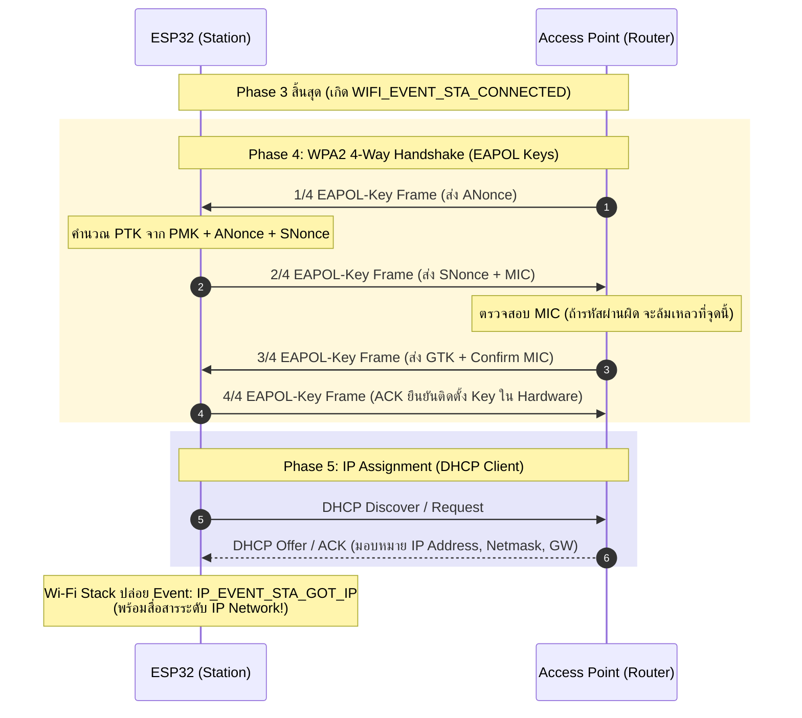
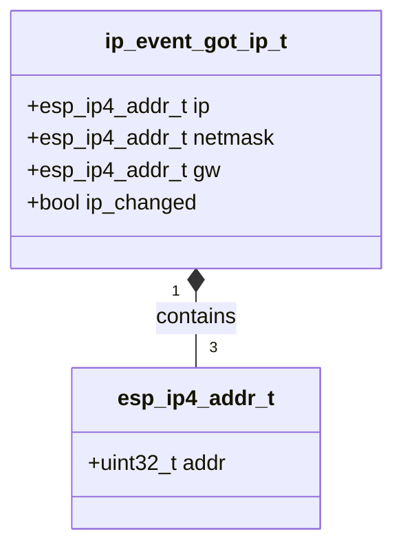

# ใบงานที่ 5.4: กระบวนการแลกเปลี่ยนคีย์ความปลอดภัยและการจัดสรรหมายเลข IP Address (4-Way Handshake & IP Assignment Phase)

## 0. กล่าวนำ (Introduction)
ใบงานนี้มุ่งเน้นศึกษาขั้นตอนสุดท้ายของการเชื่อมต่อ Wi-Fi นั่นคือ **เฟสที่ 4: Four-way Handshake Phase (การตกลงคีย์ความปลอดภัย WPA2/WPA3)** และ **เฟสที่ 5: IP Assignment Phase (การขอรับหมายเลข IP Address ผ่าน DHCP)** บนเฟรมเวิร์ก ESP-IDF

นักศึกษาจะได้ศึกษาถึงกลไกการแลกเปลี่ยนเฟรม **EAPOL-Key Frames (1/4 ถึง 4/4)** เพื่อพิสูจน์ทราบความถูกต้องของรหัสผ่าน (Pre-Shared Key - PSK) โดยไม่มีการส่งรหัสผ่านจริงผ่านคลื่นวิทยุ รวมถึงสังเกตการณ์ทำงานเมื่อพิมพ์รหัสผ่านผิด ซึ่งจะนำไปสู่ความล้มเหลวในการตรวจสอบค่า MIC (Message Integrity Code) และเกิด Disconnect Event ด้วย Reason Code `15` (`WIFI_REASON_HANDSHAKE_TIMEOUT`) หรือ `204` (`WIFI_REASON_4WAY_HANDSHAKE_TIMEOUT`)

---

## 1. วัตถุประสงค์ (Objectives)
1. เรียนรู้กลไกการแลกเปลี่ยนคีย์ความปลอดภัย WPA2 Personal (4-Way Handshake) ผ่านโปรโตคอล EAPOL
2. เข้าใจบทบาทของ PMK (Pairwise Master Key), ANonce, SNonce, PTK (Pairwise Transient Key) และ MIC (Message Integrity Code)
3. สังเกตและวิเคราะห์ลำดับการเกิด Event ระหว่าง **`WIFI_EVENT_STA_CONNECTED`** (สำเร็จในเฟส 3 Link-Layer) และ **`IP_EVENT_STA_GOT_IP`** (สำเร็จในเฟส 5 Network Layer)
4. อ่านโครงสร้างข้อมูล `ip_event_got_ip_t` เพื่อดึงค่า IP Address, Subnet Mask และ Gateway
5. ตรวจสอบความผิดปกติเมื่อพิมพ์รหัสผ่าน Wi-Fi ผิดผ่าน Disconnect Reason Code ในเฟสที่ 4

---

## 2. อุปกรณ์และซอฟต์แวร์ที่ใช้ในการทดลอง (Equipment & Tools)
1. บอร์ดไมโครคอนโทรลเลอร์ ESP32 (เช่น ESP32 DevKit V1) จำนวน 1 บอร์ด
2. สายเชื่อมต่อ Micro-USB หรือ USB-C จำนวน 1 เส้น
3. คอมพิวเตอร์ที่ติดตั้งโปรแกรม IDE เช่น VS Code พร้อมทั้ง ESP-IDF (อาจจะติดตั้งบนเครื่องหรือบน Docker ก็ได้)

---

## 3. ความรู้พื้นฐานที่เกี่ยวข้อง (Theoretical Background - ESP-IDF Framework)

### 3.1 ลำดับขั้นการแลกเปลี่ยนแพ็กเกจ 4-Way Handshake และ DHCP (Sequence Diagram)



### 3.2 โครงสร้างข้อมูล `ip_event_got_ip_t` (Class Diagram)



---

## 4. ขั้นตอนและโปรแกรมทดสอบการทดลอง (Experimental Procedures)

ในใบงานนี้ จะทำการทดสอบสถาปนาการเชื่อมต่อจนถึงขั้นตกลงคีย์เข้ารหัสและรับ IP Address ใน 2 สถานการณ์:

### 5.4.1 การเชื่อมต่อสำเร็จด้วย Password ที่ถูกต้อง (Success Case)
กำหนดค่า SSID และ Password ที่ถูกต้องตามความเป็นจริง สังเกต Forensic Log จากเฟส 3 (`WIFI_EVENT_STA_CONNECTED`) ไปสู่เฟส 4 (4-Way Handshake) และสิ้นสุดที่เฟส 5 (`IP_EVENT_STA_GOT_IP`) พร้อมบันทึกหมายเลข IP Address, Subnet Mask และ Gateway

### 5.4.2 การจำลองความล้มเหลวใน 4-Way Handshake เมื่อพิมพ์ Password ผิด (Handshake Failure Case)
กำหนดค่า SSID ถูกต้องแต่ระบุ Password ผิด (`"WRONG_PASSWORD_1234"`) สังเกต Forensic Log เพื่อยืนยันว่า ESP32 สามารถผ่านเฟส 2 และ 3 ได้ (`WIFI_EVENT_STA_CONNECTED`) แต่จะถูกตัดการเชื่อมต่อในเฟส 4 เนื่องจาก MIC ไม่ตรงกัน ส่งผลให้เกิด Disconnect Event ด้วย Reason Code `15` (`WIFI_REASON_HANDSHAKE_TIMEOUT`) หรือ `204` (`WIFI_REASON_4WAY_HANDSHAKE_TIMEOUT`)

---

## 5. ซอร์สโค้ดการทดลอง (Complete ESP-IDF Source Code - `main.c`)

ให้นักศึกษานำซอร์สโค้ด C ต่อไปนี้ไปวางในไฟล์ `main/main.c` ของโปรเจกต์ ESP-IDF ทำการ Build และ Flash ลงบอร์ด ESP32 จากนั้นเปิด ESP-IDF Monitor (Baud Rate `115200`) เพื่อสังเกตผลการทำงาน

```c
#include <stdio.h>
#include <string.h>
#include "freertos/FreeRTOS.h"
#include "freertos/task.h"
#include "freertos/event_groups.h"
#include "esp_system.h"
#include "esp_wifi.h"
#include "esp_event.h"
#include "esp_log.h"
#include "nvs_flash.h"
#include "esp_netif.h"

static const char *TAG = "LAB_HANDSHAKE_IP";

static EventGroupHandle_t s_wifi_event_group;

#define WIFI_CONNECTED_BIT BIT0
#define WIFI_FAIL_BIT      BIT1

#define TARGET_WIFI_SSID   "MY_SSID"
#define TARGET_WIFI_PASS   "MY_PASSWORD"

static const char *get_disconnect_reason_info(uint8_t reason) {
  switch (reason) {
  case WIFI_REASON_UNSPECIFIED:
    return "WIFI_REASON_UNSPECIFIED (1)";
  case WIFI_REASON_AUTH_EXPIRE:
    return "WIFI_REASON_AUTH_EXPIRE (2)";
  case WIFI_REASON_AUTH_FAIL:
    return "WIFI_REASON_AUTH_FAIL (1/202)";
  case WIFI_REASON_ASSOC_EXPIRE:
    return "WIFI_REASON_ASSOC_EXPIRE (4)";
  case WIFI_REASON_ASSOC_FAIL:
    return "WIFI_REASON_ASSOC_FAIL (3/203)";
  case WIFI_REASON_HANDSHAKE_TIMEOUT:
    return "WIFI_REASON_HANDSHAKE_TIMEOUT (15) [Phase 4: MIC mismatch / EAPOL timeout]";
  case WIFI_REASON_4WAY_HANDSHAKE_TIMEOUT:
    return "WIFI_REASON_4WAY_HANDSHAKE_TIMEOUT (204) [Phase 4: Wrong Password]";
  case WIFI_REASON_NO_AP_FOUND:
    return "WIFI_REASON_NO_AP_FOUND (201) [Phase 1: SSID Not Found]";
  case WIFI_REASON_BEACON_TIMEOUT:
    return "WIFI_REASON_BEACON_TIMEOUT (200)";
  default:
    return "OTHER_DISCONNECT_REASON";
  }
}

static void wifi_event_handler(void *arg, esp_event_base_t event_base,
                               int32_t event_id, void *event_data) {
  if (event_base == WIFI_EVENT) {
    switch (event_id) {
    case WIFI_EVENT_STA_START:
      ESP_LOGI(TAG, "[EVENT FORENSIC]: WIFI_EVENT_STA_START received");
      ESP_LOGI(TAG, "[FORENSIC]: Call esp_wifi_connect()");
      esp_err_t err_conn = esp_wifi_connect();
      ESP_LOGI(TAG, "[FORENSIC]: esp_wifi_connect() returned %s (0x%x)",
               esp_err_to_name(err_conn), err_conn);
      break;

    case WIFI_EVENT_STA_CONNECTED: {
      wifi_event_sta_connected_t *event =
          (wifi_event_sta_connected_t *)event_data;
      ESP_LOGI(TAG, "=======================================================");
      ESP_LOGI(TAG, "[EVENT FORENSIC]: WIFI_EVENT_STA_CONNECTED received!");
      ESP_LOGI(TAG, "  -> Phase 2 (Auth) & Phase 3 (Assoc) PASSED");
      ESP_LOGI(TAG, "  -> Connected SSID  : %s", event->ssid);
      ESP_LOGI(TAG, "  -> BSSID           : %02X:%02X:%02X:%02X:%02X:%02X",
               event->bssid[0], event->bssid[1], event->bssid[2],
               event->bssid[3], event->bssid[4], event->bssid[5]);
      ESP_LOGI(TAG, "  -> Channel         : %d", event->channel);
      ESP_LOGI(TAG, "  -> Association ID  : %d", event->aid);
      ESP_LOGI(TAG, "[FORENSIC]: Entering Phase 4: 4-Way EAPOL Key Exchange...");
      ESP_LOGI(TAG, "=======================================================");
      break;
    }

    case WIFI_EVENT_STA_DISCONNECTED: {
      wifi_event_sta_disconnected_t *event =
          (wifi_event_sta_disconnected_t *)event_data;
      ESP_LOGW(TAG, "=======================================================");
      ESP_LOGW(TAG, "[EVENT FORENSIC]: WIFI_EVENT_STA_DISCONNECTED received!");
      ESP_LOGW(TAG, "  -> Target SSID          : %s", event->ssid);
      ESP_LOGW(TAG, "  -> Reason Code (Decimal): %d", event->reason);
      ESP_LOGW(TAG, "  -> Reason Code (Hex)    : 0x%02X", event->reason);
      ESP_LOGW(TAG, "  -> Reason Diagnosis     : %s",
               get_disconnect_reason_info(event->reason));
      ESP_LOGW(TAG, "=======================================================");
      xEventGroupSetBits(s_wifi_event_group, WIFI_FAIL_BIT);
      break;
    }

    default:
      ESP_LOGI(TAG, "[EVENT FORENSIC]: WIFI_EVENT ID %ld received", event_id);
      break;
    }
  } else if (event_base == IP_EVENT) {
    if (event_id == IP_EVENT_STA_GOT_IP) {
      ip_event_got_ip_t *event = (ip_event_got_ip_t *)event_data;
      ESP_LOGI(TAG, "=======================================================");
      ESP_LOGI(TAG, "[EVENT FORENSIC]: IP_EVENT_STA_GOT_IP received!");
      ESP_LOGI(TAG, "  [SUCCESS]: Phase 4 (4-Way Handshake) & Phase 5 (DHCP IP) COMPLETED!");
      ESP_LOGI(TAG, "  -> Allocated IP Address : " IPSTR, IP2STR(&event->ip_info.ip));
      ESP_LOGI(TAG, "  -> Subnet Mask          : " IPSTR, IP2STR(&event->ip_info.netmask));
      ESP_LOGI(TAG, "  -> Default Gateway      : " IPSTR, IP2STR(&event->ip_info.gw));
      ESP_LOGI(TAG, "=======================================================");
      xEventGroupSetBits(s_wifi_event_group, WIFI_CONNECTED_BIT);
    }
  }
}

static void test_handshake_ip_phase(const char *test_title, const char *ssid,
                                     const char *password) {
  ESP_LOGI(TAG, "\n");
  ESP_LOGI(TAG, "------------------------------------------------------------------");
  ESP_LOGI(TAG, ">>> %s", test_title);
  ESP_LOGI(TAG, "------------------------------------------------------------------");
  ESP_LOGI(TAG, "  Target SSID    : \"%s\"", ssid);
  ESP_LOGI(TAG, "  Target Password: \"%s\"", password);

  xEventGroupClearBits(s_wifi_event_group, WIFI_CONNECTED_BIT | WIFI_FAIL_BIT);

  wifi_config_t wifi_config = {
      .sta = {
          .threshold.authmode = WIFI_AUTH_WPA2_PSK,
      },
  };
  strncpy((char *)wifi_config.sta.ssid, ssid, sizeof(wifi_config.sta.ssid));
  strncpy((char *)wifi_config.sta.password, password,
          sizeof(wifi_config.sta.password));

  ESP_LOGI(TAG, "[FORENSIC]: Call esp_wifi_stop()");
  esp_wifi_stop();

  ESP_LOGI(TAG, "[FORENSIC]: Call esp_wifi_set_config(WIFI_IF_STA, &wifi_config)");
  esp_err_t err_cfg = esp_wifi_set_config(WIFI_IF_STA, &wifi_config);
  ESP_LOGI(TAG, "[FORENSIC]: esp_wifi_set_config() returned %s (0x%x)",
           esp_err_to_name(err_cfg), err_cfg);

  ESP_LOGI(TAG, "[FORENSIC]: Call esp_wifi_start()");
  esp_err_t err_start = esp_wifi_start();
  ESP_LOGI(TAG, "[FORENSIC]: esp_wifi_start() returned %s (0x%x)",
           esp_err_to_name(err_start), err_start);

  EventBits_t bits = xEventGroupWaitBits(s_wifi_event_group,
                                         WIFI_CONNECTED_BIT | WIFI_FAIL_BIT,
                                         pdFALSE, pdFALSE, pdMS_TO_TICKS(10000));

  if (bits & WIFI_CONNECTED_BIT) {
    ESP_LOGI(TAG, "[RESULT]: TEST PASSED - 4-Way Handshake & DHCP IP Assignment Successful!");
  } else if (bits & WIFI_FAIL_BIT) {
    ESP_LOGW(TAG, "[RESULT]: TEST FAILED - Disconnected during Handshake or Auth.");
  } else {
    ESP_LOGE(TAG, "[RESULT]: TEST TIMEOUT - Response timeout from AP/DHCP Server.");
  }
}

void app_main(void) {
  s_wifi_event_group = xEventGroupCreate();

  // 1. Initialize NVS Flash
  ESP_LOGI(TAG, "[FORENSIC]: Call nvs_flash_init()");
  esp_err_t ret = nvs_flash_init();
  ESP_LOGI(TAG, "[FORENSIC]: nvs_flash_init() returned %s (0x%x)",
           esp_err_to_name(ret), ret);
  if (ret == ESP_ERR_NVS_NO_FREE_PAGES ||
      ret == ESP_ERR_NVS_NEW_VERSION_FOUND) {
    ESP_LOGI(TAG, "[FORENSIC]: Call nvs_flash_erase()");
    ESP_ERROR_CHECK(nvs_flash_erase());
    ret = nvs_flash_init();
    ESP_LOGI(TAG, "[FORENSIC]: nvs_flash_init() retry returned %s (0x%x)",
             esp_err_to_name(ret), ret);
  }
  ESP_ERROR_CHECK(ret);

  // 2. Initialize Network Interface and Event Loop
  ESP_LOGI(TAG, "[FORENSIC]: Call esp_netif_init()");
  ESP_ERROR_CHECK(esp_netif_init());

  ESP_LOGI(TAG, "[FORENSIC]: Call esp_event_loop_create_default()");
  ESP_ERROR_CHECK(esp_event_loop_create_default());

  ESP_LOGI(TAG, "[FORENSIC]: Call esp_netif_create_default_wifi_sta()");
  esp_netif_t *sta_netif = esp_netif_create_default_wifi_sta();
  ESP_LOGI(TAG, "[FORENSIC]: esp_netif_create_default_wifi_sta() returned %p", sta_netif);

  // 3. Initialize Wi-Fi Driver
  wifi_init_config_t cfg = WIFI_INIT_CONFIG_DEFAULT();
  ESP_LOGI(TAG, "[FORENSIC]: Call esp_wifi_init(&cfg)");
  ESP_ERROR_CHECK(esp_wifi_init(&cfg));

  // 4. Register Event Handlers (WIFI_EVENT & IP_EVENT)
  esp_event_handler_instance_t instance_any_id;
  esp_event_handler_instance_t instance_got_ip;
  ESP_LOGI(TAG, "[FORENSIC]: Call esp_event_handler_instance_register(WIFI_EVENT)");
  ESP_ERROR_CHECK(esp_event_handler_instance_register(
      WIFI_EVENT, ESP_EVENT_ANY_ID, &wifi_event_handler, NULL,
      &instance_any_id));

  ESP_LOGI(TAG, "[FORENSIC]: Call esp_event_handler_instance_register(IP_EVENT)");
  ESP_ERROR_CHECK(esp_event_handler_instance_register(
      IP_EVENT, IP_EVENT_STA_GOT_IP, &wifi_event_handler, NULL,
      &instance_got_ip));

  ESP_LOGI(TAG, "[FORENSIC]: Call esp_wifi_set_mode(WIFI_MODE_STA)");
  ESP_ERROR_CHECK(esp_wifi_set_mode(WIFI_MODE_STA));

  ESP_LOGI(TAG, "==================================================================");
  ESP_LOGI(TAG, "  Lab 5.4: 4-Way Handshake & IP Assignment Phase (ESP-IDF Forensic)");
  ESP_LOGI(TAG, "==================================================================");

  // ------------------------------------------------------------------
  // 5.4.1 Successful 4-Way Handshake & DHCP IP Assignment Case
  // ------------------------------------------------------------------
  test_handshake_ip_phase("Experiment 5.4.1: Handshake & IP Test - Correct Password",
                          TARGET_WIFI_SSID, TARGET_WIFI_PASS);

  vTaskDelay(pdMS_TO_TICKS(2000));

  // ------------------------------------------------------------------
  // 5.4.2 Simulated Handshake Failure Case: Wrong Password
  // ------------------------------------------------------------------
  test_handshake_ip_phase("Experiment 5.4.2: Handshake Test - Incorrect Password",
                          TARGET_WIFI_SSID, "WRONG_PASSWORD_1234");

  ESP_LOGI(TAG, "==================================================================");
  ESP_LOGI(TAG, "  [Phase 4 & Phase 5 Completed: Wi-Fi Handshake & IP Lab Finished]");
  ESP_LOGI(TAG, "==================================================================");
}
```

---

## 6. ตารางบันทึกผลการทดลอง (Experiment Results)

ให้นักศึกษาบันทึกผลลัพธ์จากการสังเกตใน Serial Console ลงในตารางต่อไปนี้:

### 6.1 ตารางสรุปเปรียบเทียบผลการทดลองใน Handshake & IP Phase

| ข้อการทดลอง | สถานการณ์ทดสอบ | Event `WIFI_EVENT_STA_CONNECTED` (เกิด/ไม่เกิด) | Event `IP_EVENT_STA_GOT_IP` (เกิด/ไม่เกิด) | ผลการทดลอง | Disconnect Reason Code (ถ้ามี) |
| :---: | :--- | :---: | :---: | :---: | :--- |
| **5.4.1** | Password ถูกต้อง | ไม่เกิด | ไม่เกิด | ล้มเหลว (Failed) | 201 (0xC9) WIFI_REASON_NO_AP_FOUND |
| **5.4.2** | Password ผิด | ไม่เกิด | ไม่เกิด | ล้มเหลว (Failed) | 201 (0xC9) WIFI_REASON_NO_AP_FOUND |

### 6.2 บันทึกข้อมูล IP Network จาก Event `IP_EVENT_STA_GOT_IP` (ข้อ 5.4.1)

| พารามิเตอร์ Network Layer | ค่าที่จัดสรรได้จริงจาก DHCP Server |
| :--- | :--- |
| **IP Address** | N/A (ไม่ได้รับเนื่องจากหา AP ไม่พบ) |
| **Subnet Mask** | N/A |
| **Default Gateway** | N/A |

---

## 7. คำถามท้ายการทดลอง (Post-Lab Questions)

### 1. เหตุใดกระบวนการ 4-Way Handshake จึงพิสูจน์ทราบรหัสผ่าน Wi-Fi ได้โดยไม่ต้องส่งรหัสผ่าน (Passphrase) ลอยไปในอากาศเลยแม้แต่แพ็กเกจเดียว?
* **คำอธิบาย:** เพราะทั้งฝั่ง AP และ ESP32 นำรหัสผ่านไปแปลงเป็น **PMK (Pairwise Master Key)** ล่วงหน้าภายในฝั่งตนเอง จากนั้นระหว่างทำ 4-Way Handshake ทั้งสองฝั่งแลกเปลี่ยนเฉพาะค่าสุ่ม (**ANonce** จาก AP และ **SNonce** จาก Station) เพื่อนำมาคำนวณสร้างคีย์ชั่วคราวชื่อ **PTK**
* ความถูกต้องของรหัสผ่านถูกตรวจสอบผ่านค่า **MIC (Message Integrity Code)** ที่แนบมากับเฟรม EAPOL-Key หากรหัสผ่านตรงกัน ค่า PTK ที่สร้างได้จะเหมือนกัน ส่งผลให้ค่า MIC ตรงกัน จึงสามารถพิสูจน์รหัสผ่านได้โดยไม่ต้องส่ง Text รหัสผ่านผ่านคลื่นวิทยุเลย

---

### 2. อธิบายบทบาทและที่มาของคีย์ PMK (Pairwise Master Key) และ PTK (Pairwise Transient Key) ว่ามีความสัมพันธ์กันอย่างไรในการเข้ารหัสเฟรมข้อมูล?
* **PMK (Pairwise Master Key):** เป็นคีย์หลักแบบ Static ที่คำนวณถอดรหัสมาจาก `Password WPA2 + SSID` ผ่านอัลกอริทึม PBKDF2 (เป็นวัตถุดิบตั้งต้น)
* **PTK (Pairwise Transient Key):** เป็นคีย์ชั่วคราวแบบ Dynamic ที่ถูกคำนวณขึ้นใหม่ทุกครั้งที่เชื่อมต่อ โดยนำ `PMK + ANonce + SNonce + MAC(AP) + MAC(Station)` มารวมกัน
* **ความสัมพันธ์ในการเข้ารหัส:** PMK ทำหน้าที่เป็นต้นทางในการสร้าง PTK ส่วน PTK จะถูกย่อยออกเป็นคีย์ย่อยต่างๆ โดยมีคีย์ **TK (Temporal Key)** นำไปใช้เข้ารหัส/ถอดรหัสเฟรมข้อมูล Unicast (เช่น AES-CCMP) ระหว่าง ESP32 กับ AP จริงๆ

---

### 3. เหตุใดเมื่อเราพิมพ์ Password ผิด (ข้อ 5.4.2) ESP32 จึงยังคงได้รับ Event `WIFI_EVENT_STA_CONNECTED` ก่อนที่จะเกิด Event `WIFI_EVENT_STA_DISCONNECTED` ตามมาในภายหลัง?
* **คำอธิบาย:** เนื่องจาก Event `WIFI_EVENT_STA_CONNECTED` ถูกยิงออกมาเมื่อจบ **Phase 3 (Association Phase)** ซึ่งเป็นเพียงการตกลงเชื่อมต่อระดับ Link Layer (Layer 2 Open System Auth) เท่านั้น **โดยยังไม่ได้มีการตรวจสอบรหัสผ่าน WPA2**
* เมื่อจบ Phase 3 ไดรเวอร์จะยิง Event `WIFI_EVENT_STA_CONNECTED` รายงานก่อน แล้วระบบจึงขยับเข้าสู่ **Phase 4 (4-Way Handshake)** เพื่อเช็ครหัสผ่าน เมื่อใส่ Password ผิด ค่า MIC ในเฟรม EAPOL-Key จะไม่ตรงกัน ทำให้ Handshake ล้มเหลว AP/ESP32 จึงตัดการเชื่อมต่อและส่ง Event `WIFI_EVENT_STA_DISCONNECTED` (Reason Code 15/204) ตามมาในภายหลัง

---

### 4. หากเครือข่าย Wi-Fi ไม่มี DHCP Server (ไม่มีการแจก IP อัตโนมัติ) ผลการทดลองในข้อ 5.4.1 จะหยุดอยู่ที่ขั้นตอนใด และจะไม่เกิด Event ใดขึ้น?
* **ขั้นตอนที่หยุด:** การทดลองจะหยุดลงที่ **Phase 4 (4-Way Handshake สำเร็จ)**
* **Event ที่จะไม่เกิดขึ้น:** จะ**ไม่เกิด Event `IP_EVENT_STA_GOT_IP`** เนื่องจากฝั่ง ESP32 ส่งคำร้องขอ DHCP Discover ออกไปแล้วแต่ไม่มี DHCP Server ตอบกลับเฟรม DHCP Offer/ACK ทำให้กระบวนการใน Phase 5 ไม่สมบูรณ์และเกิด Timeout ในที่สุด
